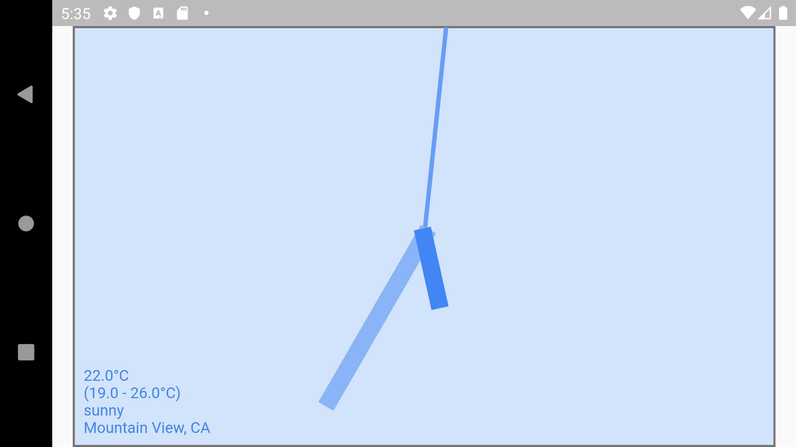
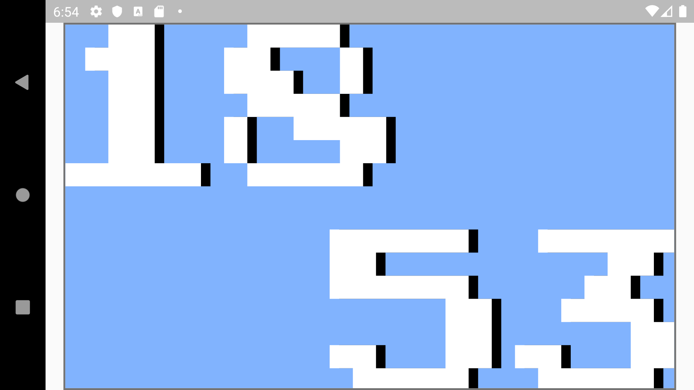

# Flutter Clock

Welcome to Flutter Clock!

Refer to [flutter.dev/clock](https://flutter.dev/clock) for how to get started, submission requirements, contest rules, and FAQs.

Example [Analog Clock](analog_clock):

Example [Digital Clock](digital_clock):

